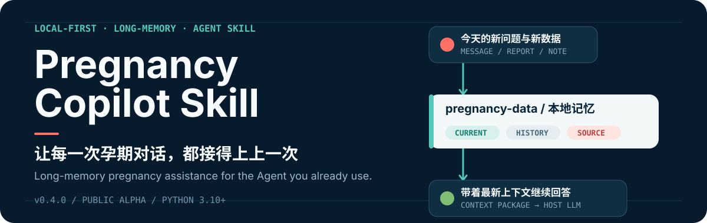
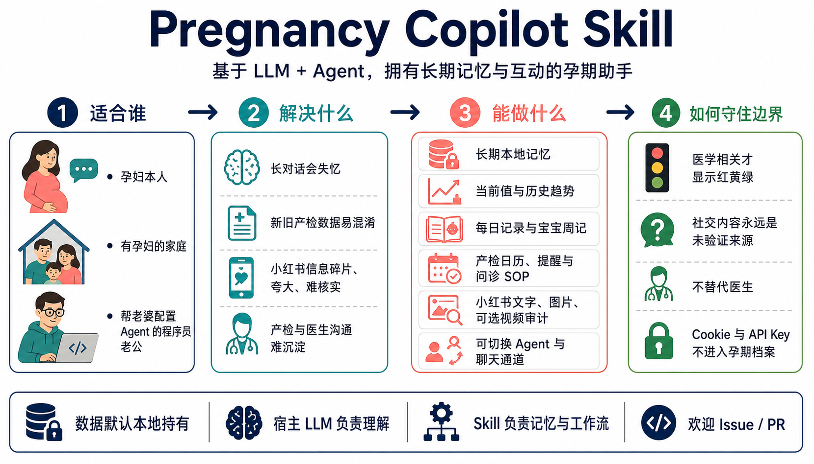

<p align="right">
  <strong>简体中文</strong> · <a href="#english-overview">English</a>
</p>

<p align="center">
  
</p>

<p align="center">
  <a href="https://github.com/Ryan-7962/pregnancy-copilot-skill/releases/latest"></a>
  
  <a href="./LICENSE"></a>
  
</p>

<p align="center">
  <strong>基于 LLM + Agent 的本地优先孕期长期助手</strong><br>
  让孕妇继续使用熟悉的聊天入口，同时把孕周、报告、症状、医嘱、日常记录和产检计划沉淀成可迁移的本地记忆。
</p>

<p align="center">
  <a href="https://github.com/Ryan-7962/pregnancy-copilot-skill/releases/latest"><strong>下载最新版</strong></a>
  · <a href="./INSTALL.md">安装指南</a>
  · <a href="./docs/HERMES_QUICKSTART.md">Hermes / OpenClaw 接入</a>
  · <a href="https://github.com/Ryan-7962/pregnancy-copilot-skill/issues">反馈问题</a>
</p>

> [!IMPORTANT]
> Pregnancy Copilot 是 **Agent Skill**，不是独立 App，也不是医疗器械。宿主 Agent 负责对话与推理；本 Skill 负责长期记忆、当前医学状态、来源追踪、安全边界和孕期工作流。

## 先看懂它

<p align="center">
  
</p>

孕期真正困难的不是找不到一次答案，而是几十周的信息持续变化：这周的新报告可能刷新上周的异常值，今天的症状需要结合当前孕周和既往记录，换一个模型或聊天窗口后又容易失去上下文。

| 普通大模型对话的痛点 | Pregnancy Copilot 的处理方式 |
| --- | --- |
| 对话变长后逐渐失忆 | 将关键事实、原文和当前上下文写入本地 `pregnancy-data/` |
| 新旧检查结果容易混淆 | 新值成为 `current`，旧值保留在 `history` 供趋势和审计使用 |
| 报告、症状、体重和医嘱散落各处 | 建立 Markdown / YAML / JSONL 索引，而不是每次重扫全部聊天 |
| 小红书信息碎片化、真假难辨 | 把帖子作为 `social_media_unverified` 外部来源审计，不直接写入医学事实 |
| 更换 Agent、模型或聊天通道后上下文断裂 | 记忆层与宿主和通道解耦，可迁移到新的 Agent 工作流 |

## v0.4.0 已经能做什么

- **渐进式建档**：首次使用先回答问题，再逐步补充 LMP、EDD、当前孕周、既往史、用药、过敏、医嘱和报告；不知道的内容保持未知。
- **长期本地记忆**：保留 inbox 原文、append-only 事件、当前上下文、医学状态、每日指标和来源可信度。
- **医学数据版本化**：同一指标更新时保留完整历史，但当前判断优先使用带日期和可靠来源的最新值。
- **日常陪伴与产检闭环**：整理体重、血压、睡眠、心情、饮食和运动，生成产检前问题、检查后行动 SOP、每日记录和宝宝周记素材。
- **条件式安全分级**：普通聊天不会被强行医疗化；只有医学相关内容才显示红/黄/绿，明确红旗规则只作为宿主模型不可用时的安全下限。
- **小红书内容审计**：读取可用正文，把图片交给宿主视觉/OCR，并在用户同意后选择性转写视频；所有结论保持未验证来源。
- **宿主与通道中立**：可接入 Hermes、OpenClaw、Codex、Claude Code 或其他能调用本地 Skill 的 Agent；飞书、微信和其他入口只是可替换通道。
- **升级前保护**：备份、迁移、幂等写入、进程锁、路径校验和发布包隐私扫描均有测试覆盖。

当前版本是 **Public Alpha**。完整实现与缺口以 [`docs/TASKS.md`](./docs/TASKS.md) 和 [`docs/ROADMAP.md`](./docs/ROADMAP.md) 为准，不把路线图写成已经交付的能力。

## 它如何工作

```text
孕妇熟悉的聊天入口
        │
        ▼
Hermes / OpenClaw / Codex / Claude Code / 其他宿主 Agent
        │  宿主 LLM 负责理解、语义判断与最终回复
        ▼
Pregnancy Copilot Skill
        │  读取当前状态、追踪来源、维护记忆与工作流
        ▼
本地 pregnancy-data/
  ├── inbox/                  原始消息
  ├── events/*.jsonl         追加式事件与医学观察
  ├── memory/                当前上下文、医学状态、日常指标与索引
  ├── reports/               产检报告、医生问答与前后 SOP
  └── daily_logs/            每日记录与家庭素材
```

这里没有额外的大模型要求：安装后的 Agent 已经拥有 LLM。Skill 负责在每次回答前把正确的当前事实、历史和安全约束交给宿主模型。

## 5 分钟跑起来

### 1. 获取代码

下载 [最新 Release ZIP](https://github.com/Ryan-7962/pregnancy-copilot-skill/releases/latest)，或克隆仓库：

```bash
git clone https://github.com/Ryan-7962/pregnancy-copilot-skill.git
cd pregnancy-copilot-skill
```

### 2. 安装与自检

```bash
python3.11 -m venv .venv  # Python >= 3.10
.venv/bin/python -m pip install --upgrade pip
.venv/bin/python -m pip install -e . pytest
.venv/bin/python -m pytest -q
```

当前 v0.4.0 完整测试结果为 `302 passed`。测试数量会随版本变化，以本地实际输出为准。

### 3. 初始化本地档案

```bash
PYTHONPATH=src .venv/bin/python scripts/init_data_dir.py \
  --target ./pregnancy-data

PYTHONPATH=src .venv/bin/python scripts/check_profile_readiness.py \
  --data-root ./pregnancy-data
```

不要把真实 `pregnancy-data/` 提交到 GitHub。推荐由宿主 Agent 调用 [`build_install_onboarding_action(...)`](./INSTALL.md#required-first-run-message) 主动发送欢迎与最小建档问题；如果宿主不能主动发消息，第一条用户消息会进入同一套回答优先流程。

### 4. 接入现有 Agent

```bash
PYTHONPATH=src .venv/bin/python scripts/process_host_message.py \
  --data-root ./pregnancy-data \
  --channel agent_default \
  --conversation-id pregnancy-window \
  --sender-id pregnant-user \
  --sender-role pregnant_user \
  --text "怀孕可以坐飞机吗？"
```

宿主应读取返回的 `context_package` 生成最终回复。完整接入合约见 [`docs/HOST_AGENT_RUNTIME.md`](./docs/HOST_AGENT_RUNTIME.md)。

> [!TIP]
> 对支持读取本地文件和执行命令的 Agent，可以直接说：`请安装这个 Pregnancy Copilot Skill，先阅读 SKILL.md 和 INSTALL.md，运行测试与初始化，再把当前默认聊天窗口绑定为孕妇入口。`

## 首次使用体验

安装后，Skill 会逐步告诉用户它能做什么、什么不能做，以及记忆保存在哪里。它不会用固定五轮问卷阻断对话：

1. 先回应用户正在问的问题。
2. 每次最多补充一个简短教程或建档问题。
3. LMP、EDD 或带日期的当前孕周任一项即可建立时间锚点。
4. 报告数值必须保留日期、单位和来源；缺失信息明确标为未知。
5. 支持 `跳过教程`、`继续教程` 和 `这条不记录`。

## 小红书内容审计

孕妇只需要把 **完整分享链接** 发给自己的 Agent。`xsec_token` 通常已经包含在分享链接中，不需要单独提取；链接失效时重新从小红书复制即可。

技术安装者需要在本地私密终端配置自己的 Cookie：

```bash
PYTHONPATH=src .venv/bin/python scripts/setup_xiaohongshu_credentials.py \
  --pregnancy-data-root ./pregnancy-data

export PREGNANCY_COPILOT_XHS_COOKIE_FILE="$HOME/.config/pregnancy-copilot/secrets/xiaohongshu_cookie.txt"
```

- Skill 不内置公共 Cookie，不代管账号，也不绕过平台登录。
- Cookie 不应发送到 Agent、飞书、微信或 GitHub；凭据文件默认位于 `pregnancy-data/` 之外并使用 `0600` 权限。
- 图片由宿主 Agent 的视觉能力分析；视频 ASR 默认先征得用户同意。
- 帖子正文、OCR 和转写始终是未验证外部材料，不能直接覆盖报告、医嘱、用药或当前医学状态。

完整流程见 [`INSTALL.md`](./INSTALL.md#optional-xiaohongshu-audit)。

## 数据与安全边界

### 默认会做

- 把结构化档案和长期记忆保存在用户选择的本地 `pregnancy-data/`。
- 保留旧医学数据的历史价值，同时让最新可靠值成为当前状态。
- 信息不足时明确回答不知道，并请求日期、单位、报告原文或医生结论。
- 明确红旗症状时建议联系产科、产科急诊、医院急诊或当地急救服务。

### 明确不会做

- 不替代产科医生，不提供诊断、处方或治疗决定。
- 不把普通闲聊都变成风险分级或医学事件。
- 不默认把孕妇数据分享给伴侣、维护者或其他家庭成员。
- 不主动上传 `pregnancy-data/`，但用户选择的聊天平台、宿主模型和同机操作员仍有各自的隐私边界。
- 不写死飞书、微信或某种人格；通道与表达风格由用户自己的 Agent 配置决定。

详细规则见 [`docs/SAFETY_RULES.md`](./docs/SAFETY_RULES.md) 和 [`SECURITY.md`](./SECURITY.md)。

## 适合谁

- 希望 AI 能长期记住孕周、检查变化和日常状态的孕妇。
- 想帮伴侣搭建一个可持续孕期助手的程序员或技术家庭成员。
- 已在使用 Gemini、ChatGPT、Claude、NotebookLM、Hermes 或 OpenClaw，但担心换模型、换窗口后记忆断档的家庭。
- 正在开发 Agent workflow，希望接入一个本地优先、可审计的孕期记忆 Skill 的开发者。

孕妇是第一用户和数据所有者。技术成员可以帮助部署，但不会因此自动获得伴侣摘要或档案权限。

## 项目缘起

这个项目来自开发者家庭的真实孕期使用过程。2026 年上半年，我们大量使用 Gemini 和其他大模型讨论症状、报告、饮食、运动、医嘱和产检准备。大模型确实缓解了很多“现在该不该担心”的焦虑，也帮助家庭更理性地准备医生沟通。

长期使用后，问题同样清楚：聊天会失忆，新旧报告容易混淆，切换模型后上下文断裂，很多有价值的问答没有沉淀。Pregnancy Copilot 把这些真实使用习惯整理成一个可公开复用的 Agent Skill，希望更多有孕妇的家庭可以拥有自己的长期孕期助手，而不必从零搭建记忆系统。

## 宿主与聊天通道

| 层级 | 职责 | 当前状态 |
| --- | --- | --- |
| 宿主 Agent | LLM、对话、工具调用和最终回复 | Hermes / OpenClaw 风格合约已有验收；其他 Agent 按同一接口接入 |
| Pregnancy Copilot | 孕期记忆、当前状态、来源、安全下限和产物工作流 | v0.4.0 Public Alpha |
| 聊天通道 | 孕妇熟悉的消息入口 | 默认使用宿主已有通道；飞书/Lark 是当前测试最完整的可选适配器 |
| 本地数据 | 用户控制的事实源 | Markdown + YAML + JSONL；默认不使用云数据库 |

微信、Telegram、Slack、Discord 或 Web UI 是否可用，取决于宿主 Agent 已经支持的通道。Skill 不把某个 IM 平台作为产品边界。

## 验证与发布质量

```bash
.venv/bin/python -m pytest -q
PYTHONPATH=src .venv/bin/python scripts/run_single_user_acceptance.py \
  --data-root /tmp/pregnancy-copilot-single-user
PYTHONPATH=src .venv/bin/python scripts/run_host_runtime_acceptance.py \
  --data-root /tmp/pregnancy-copilot-host-runtime
```

公开发布包会排除真实孕期数据、私有对话、Cookie、Token、本机路径、构建目录和缓存，并在 ZIP 解压后重新安装和测试。合成案例只保留泛化后的症状和数据模式，不包含真实姓名、地点、账号或聊天原文。

## English Overview

Pregnancy Copilot is a **local-first, long-memory pregnancy assistant Skill for LLM Agents**. It runs inside the Agent a family already uses and turns ongoing conversations, dated medical observations, daily metrics, prenatal plans, and source history into portable local context.

It is not a standalone app, a medical device, or a replacement for obstetric care. The host Agent owns language understanding and final responses; Pregnancy Copilot owns the memory contract, current-versus-history semantics, source boundaries, safety floor, and pregnancy workflows.

v0.4.0 includes answer-first onboarding, local longitudinal memory, current medical state, daily conversation indexing, prenatal reminders, visit SOPs, optional family artifacts, and an optional Xiaohongshu audit workflow. Social content always remains unverified and cannot update medical facts.

Start with the [latest release](https://github.com/Ryan-7962/pregnancy-copilot-skill/releases/latest), then read [`INSTALL.md`](./INSTALL.md) and [`docs/HOST_AGENT_RUNTIME.md`](./docs/HOST_AGENT_RUNTIME.md).

## 文档导航

| 需要了解 | 文档 |
| --- | --- |
| 安装、首次建档和小红书配置 | [`INSTALL.md`](./INSTALL.md) |
| Hermes / OpenClaw 快速接入 | [`docs/HERMES_QUICKSTART.md`](./docs/HERMES_QUICKSTART.md) |
| Host Agent 合约 | [`docs/HOST_AGENT_RUNTIME.md`](./docs/HOST_AGENT_RUNTIME.md) |
| 记忆结构和医学数据版本化 | [`docs/MEMORY_SYSTEM.md`](./docs/MEMORY_SYSTEM.md) · [`docs/MEDICAL_STATE.md`](./docs/MEDICAL_STATE.md) |
| 安全、隐私和部署边界 | [`docs/SAFETY_RULES.md`](./docs/SAFETY_RULES.md) · [`docs/PRIVACY_DEPLOYMENT.md`](./docs/PRIVACY_DEPLOYMENT.md) |
| 架构、数据结构和产品范围 | [`docs/ARCHITECTURE.md`](./docs/ARCHITECTURE.md) · [`docs/DATA_SCHEMA.md`](./docs/DATA_SCHEMA.md) · [`docs/PRD.md`](./docs/PRD.md) |
| 测试与当前任务 | [`docs/USER_TESTING.md`](./docs/USER_TESTING.md) · [`docs/TASKS.md`](./docs/TASKS.md) |

## 参与改进

欢迎试用、提交 [Issue](https://github.com/Ryan-7962/pregnancy-copilot-skill/issues) 或 PR，尤其欢迎不同 Agent、不同聊天通道、报告录入、记忆结构、隐私部署和非技术用户安装体验方面的反馈。

请勿在公开 Issue、PR、截图或测试附件中上传真实孕期档案、报告、Cookie、Token、聊天记录或可识别个人的信息。安全问题请先阅读 [`SECURITY.md`](./SECURITY.md)。

## License

[MIT](./LICENSE) © 2026 Pregnancy Copilot Skill contributors
