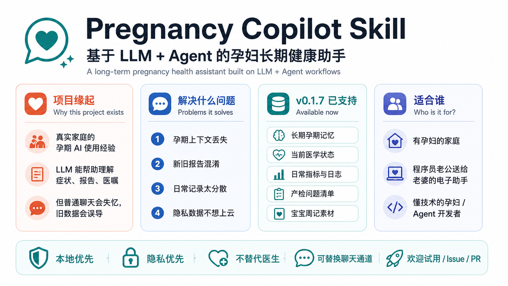

# Pregnancy Copilot Skill

> Version: v0.1.7 handoff package  
> Date: 2026-05-29  
> Status: Pre-release Agent Skill, ready for external tester review after owner approval



## 中文介绍

Pregnancy Copilot Skill 是一个基于 **LLM + Agent** 的孕妇长期健康助手。

它面向有孕妇的家庭，让你的 AI 不只是“会回答一次孕期问题”，而是能围绕整个孕期持续互动，长期记住孕周、检查报告、症状变化、医嘱、日常记录和家庭偏好。适合程序员老公帮老婆搭一个孕期 AI 助手，也适合本身懂技术的孕妇给自己配置长期 Pregnancy Copilot。

它不是一个独立 App，也不是替代医生的诊断工具。它运行在 Hermes、OpenClaw、Codex、Claude Code 或类似宿主 Agent 里。宿主 Agent 继续负责对话和推理；这个 skill 负责把孕期上下文、当前医学状态、历史记录、日常指标和家庭素材稳定地交给宿主 Agent，并默认把数据保存在本地。

## 项目缘起

这个项目来自一个很真实的家庭场景。

2026 年上半年，LLM、Agent 和 web coding 工具的能力提升很快。作为开发者，我正好也经历了老婆怀孕这件事。在真实孕期里，我们开始大量使用 Gemini 和其他大模型：问症状、看报告、拆解医嘱、确认饮食和运动边界，也用它们来缓解很多“不知道要不要紧”的孕期焦虑。

这个过程让我看到，大模型已经能在孕期陪伴里产生实际价值。它可以 24 小时回应，可以把复杂信息讲清楚，也可以帮助家庭更理性地准备产检和医生沟通。

但长期使用后，问题也很明显：普通聊天会失忆，旧报告和新报告容易混在一起，换模型或换聊天窗口会丢上下文，很多有价值的问答没有沉淀成结构化档案。

Pregnancy Copilot Skill 就是基于这些真实使用习惯和痛点整理出来的：希望把“单次问答的大模型”变成一个更适合孕期长周期使用的 Agent Skill。它优先解决长期记忆、医学数据新旧关系、隐私本地保存、产检问题整理和家庭记录沉淀。也希望把这个经验分享给更多有孕妇的家庭，让更多人可以在已有 Agent 上搭建自己的孕期长期健康助手。

## 为什么需要它

孕期焦虑往往不是因为完全没有信息，而是因为信息太碎、变化太快、上下文太长。

一个通用大模型可以回答“今天肚子发紧要不要紧”“这个报告怎么看”“这顿饭能不能吃”。但真实孕期不是一次问答，而是连续几十周的变化：

- 今天的症状，要结合当前孕周、既往病史、最近报告和医生医嘱判断。
- 上周异常的指标，可能这周已经恢复；AI 不能继续拿旧数据当当前事实。
- 产检报告、医生提醒、体重、睡眠、情绪、用药和饮食分散在聊天记录、图片、备忘录和文档里。
- 换一个模型、换一个账号、换一个聊天工具，之前积累的上下文很容易断档。
- 孕期里大量问答其实也是家庭记忆：宝宝周记、孕期日记、产检里程碑、伴侣协作事项。
- 孕期数据是敏感健康数据，应该默认由家庭自己保存和控制。

Pregnancy Copilot Skill 想解决的是这个长期问题：让 AI 不再失忆、不再混淆旧报告和新报告，并把每一次有价值的孕期对话沉淀成可迁移、可复盘、可继续使用的本地档案。

## v0.1.7 目前能做什么

v0.1.7 是可测试的 Agent Skill 骨架，不是完整消费级 App。当前已经实现并有测试覆盖的能力包括：

- 初始化本地 `pregnancy-data/` 目录和 `profile.yaml`。
- 首次建档门禁：缺少关键孕期信息时，先要求补充基础档案/最近报告。
- 保存聊天原文到 `inbox/`，把孕期相关内容写入 `events.jsonl`。
- 生成 `memory/current_context.md`，供宿主 Agent 回答时读取。
- 维护 `memory/current_medical_state.yaml`：同一医学指标有新值时，新值成为 current，旧值保留为历史。
- 记录体重、睡眠、心情、饮食、运动等日常高频数据到 `memory/daily_metrics.yaml`。
- 对症状、异常报告或需要医生确认的线索提供红 / 黄 / 绿安全提示；普通闲聊不会被医疗化。
- 生成下次产检问题清单、日常日志、宝宝周记素材和可选伴侣 summary。
- 提供 Host Runtime，便于 Hermes/OpenClaw/Codex/Claude Code 等宿主 Agent 调用。
- 提供飞书/Lark CLI 适配器和确定性 runtime worker，方便当前版本测试真实聊天通道。
- 提供公开合成案例测试，不包含真实隐私数据。

欢迎试用、提 issue、给反馈，尤其是这些方向：不同宿主 Agent 的接入方式、微信/其他聊天通道实践、报告录入体验、孕期记忆结构、隐私部署方案和非技术用户安装流程。

## 项目特点

- **长期陪伴，而不是一次性问答**：围绕整个孕期持续记录和更新，让宿主 Agent 每次回答前都能读取当前孕周、最新报告、近期症状和历史上下文。
- **绝对本地持有的孕期记忆**：默认使用本地 Markdown / YAML / JSONL 文件保存，真实 `pregnancy-data/` 不进入发布包，也不默认上传云端。
- **适合作为程序员老公送给老婆的电子助手**：技术配置者可以把它装到 Hermes/OpenClaw 等 Agent 里，再通过老婆更习惯的聊天入口使用；数据所有权默认仍属于孕妇。
- **帮助降低孕期焦虑**：不是靠安慰话术，而是用结构化上下文帮助 AI 更理性地解释症状、报告、饮食、用药、运动和产检问题。
- **24 小时待命的家庭 Agent 能力**：只要宿主 Agent 和聊天通道在线，孕妇可以随时提问；skill 会提供长期记忆和安全边界。
- **医学数据有新旧关系**：同一指标更新时，新值成为当前事实，旧值保留为历史趋势和审计线索，避免 AI 一直引用过期异常值。
- **把零散对话变成可复盘档案**：原文保存在 `inbox/`，结构化事件进入 `events.jsonl`，当前上下文、医学状态、日常指标和日志自动生成。
- **产检前问题清单**：当前版本已支持把需要问医生的问题沉淀到 doctor questions，帮助下次产检前整理重点。
- **家庭记忆素材**：当前版本已支持日常日志、宝宝周记素材、可选伴侣 summary 和爸爸日记等基础产物。

## 接下来希望补齐的方向

这些是项目方向，不是 v0.1.7 已完整实现的承诺。欢迎试用者一起提 issue 或 PR：

- **产检日历与提醒**：根据孕周和医院流程生成检查日历，提醒下一次产检、糖耐、B 超、复查、用药等事项。
- **产检前问诊 SOP**：结合近期症状、日常数据、历史异常和医生待问问题，自动生成“这次去医院要问什么”的清单。
- **检查后行动 SOP**：把医生回复、检查结果和新的注意事项整理成下一阶段行动计划，例如复查、饮食、运动、用药、观察指标。
- **更强报告录入**：支持更稳定的 OCR/报告结构化，把 B 超、血常规、尿检、糖耐等报告转成可更新的医学状态。
- **更多聊天通道**：在飞书/Lark 之外，探索微信、Telegram、Slack、Discord、Web UI 或宿主 Agent 默认聊天入口。
- **更低门槛安装**：减少技术用户配置成本，让普通家庭更容易使用。

## English Overview

Pregnancy Copilot Skill is a **long-term pregnancy health assistant built on LLM + Agent workflows**.

It is designed for families going through pregnancy. It is not a standalone app, a medical device, or a replacement for obstetric care. It runs inside a host Agent such as Hermes, OpenClaw, Codex, Claude Code, or a similar local/agent workflow. The host Agent provides the LLM and conversation interface; this skill provides durable pregnancy memory, current medical state, source history, daily metrics, safety prompts, and family-memory artifacts.

The core problem is not one-off pregnancy Q&A. Many general LLMs can answer simple questions. The harder problem is long-running pregnancy context:

- pregnancy lasts for weeks and months, and chat memory fades;
- medical values change over time, and old abnormal values may later be resolved;
- reports, symptoms, medication notes, diet, mood, weight, and doctor advice are scattered across different tools;
- switching models, accounts, or chat channels can break continuity;
- pregnancy data is sensitive health data and should be controlled by the family by default.

v0.1.7 can initialize a local `pregnancy-data/` folder, store raw messages and structured events, maintain current-vs-historical medical observations, build a current context package for the host Agent, track daily metrics, apply conditional red/yellow/green safety prompts for symptom or abnormal-report messages, and generate basic family artifacts such as daily logs, doctor questions, and baby weekly diary material. Planned directions include prenatal-visit calendars, reminders, pre-visit question SOPs, post-visit action SOPs, stronger report parsing, and more chat channels.

Feishu/Lark CLI is the most tested channel adapter in v0.1.7, but it is not the product boundary. We welcome experiments and feedback for WeChat, Telegram, Slack, Discord, web UI, and host-Agent default chat channels.

## 它不做什么

- 不替代产科医生、医院、急诊或本地医疗指南。
- 不把所有聊天都医疗化；普通闲聊应交回宿主 Agent。
- 不默认把孕妇数据分享给伴侣、家庭成员或维护者。
- 不要求用户固定使用飞书；飞书只是一个可选通道适配器。
- 不内置强制人格。极客风格、温柔风格、严肃风格或其他 Agent soul 都应由用户自己配置。

## 适合谁

- 有孕妇的家庭，希望用 AI 降低孕期信息焦虑，但又不想把敏感健康数据锁进单一云端工具。
- 程序员老公想帮老婆搭一个孕期 AI 助手，用更结构化、更理性的方式陪伴孕期。
- 本身懂技术的孕妇，希望给自己配置一个长期可迁移的 Pregnancy Copilot。
- 正在用 ChatGPT、Gemini、Claude、NotebookLM 或本地 Agent 记录孕期信息，但担心长期记忆丢失的用户。
- 正在做 OpenClaw、Hermes、Codex、Claude Code 等 Agent workflow，希望接入一个本地优先孕期 memory skill 的开发者。
- 想把孕期问答沉淀成宝宝周记、产检问题清单、日常日志和可迁移档案的家庭用户。

## 关键原则

1. **Q&A first, logging second**  
   用户只需要自然提问，系统自动沉淀记忆。

2. **Memory is sacred**  
   孕期数据对个人无价，任何升级都不能丢失原始数据。

3. **Current facts beat old memories**  
   同一医学指标有新值时，新值进入当前医学状态；旧值保留为历史趋势和审计线索。

4. **Local-first by default**  
   默认本地 Markdown + JSONL 保存，用户自行决定是否同步到飞书或云端。

5. **Doctor-guided, not doctor-replacing**  
   提供类问诊式支持，但不替代医生诊断。

6. **Pregnant-user-first, privacy-first**  
   孕妇是第一用户和数据所有者。技术配置者可以帮她安装 Agent 和聊天通道，但不因此成为默认数据管理员。

7. **Artifacts matter**  
   AI 不只是回答问题，还要把孕期数据变成家庭回忆作品。

## v0.1.7 默认部署

- 推荐路径：Hermes/OpenClaw 主 Agent 调用 Host Agent Runtime，并把孕妇常用聊天窗口或机器人作为入口
- 当前测试拓扑：宿主 Agent 的默认聊天通道先视作孕妇自己的对话入口；飞书、微信等只是可替换网关
- 兼容路径：飞书 P2P 机器人 + 正在运行的 event loop
- Skill core 负责长期记忆、医疗数据版本化、当前有效医学状态和上下文注入；主要医学判断交给宿主大模型
- 日常高频数据会进入 `memory/daily_metrics.yaml`，用于体重、心情、饮食、运动和睡眠的快速上下文读取
- Gemini/NotebookLM/Obsidian 迁移历史默认只作为线索层；`source_confidence.yaml` 和 `open_review_items.yaml` 会区分报告事实、用户自述、模型推断和待核对项
- 回答风格默认中性克制；极客风格、昵称或 agent_soul 必须由用户在 `profile.yaml` 显式启用
- Host Runtime 返回 `context_package`，可直接作为 Hermes/OpenClaw/Codex/Claude Code 的大模型上下文包
- 消息先进入 skill 内部 intent/context policy；只有明确医学审计需要时才展示红黄绿，非医学记录不被医疗化
- 单 host Agent，可管理一个或多个孕妇聊天入口
- 默认模式：孕妇 Q&A / 孕期记录 / 医学状态更新 / 宝宝周记
- 可选扩展模式：伴侣 summary / 爸爸日记 / 家庭协作
- 本地 Markdown + JSONL 记忆存储
- 飞书文档/多维表格作为展示层，而不是主数据源
- 默认不使用云数据库
- 支持通过 `lark-cli --profile` 选择飞书 app/profile，便于测试不同聊天通道或机器人
- 默认不实现完整双 bot 邀请/授权流程；该流程进入 v0.2
- 默认不做国际版产检流程

注意：飞书机器人本身不会自动回复。推荐让 Hermes/OpenClaw 接收孕妇侧窗口/机器人消息后调用 `pregnancy_copilot.host_runtime.process_host_message`。如果不走 host runtime，则必须有 `scripts/run_feishu_event_loop.py` 常驻运行。P2P smoke test 只证明“临时 event loop 启动时能跑通”，不代表机器人已经 24/7 连接到 Hermes。

v0.1.7 增加首次建档门禁：如果 `profile.yaml` 仍是模板或缺关键孕期锚点，非红色急症消息只保存 inbox 原文，并要求用户先提供基础档案/最近报告，不写入正式医疗事件，也不展示红黄绿判断。收到明确“建档信息”后，会更新 `profile.yaml`，并把 NT、CRL、胎心、胎盘位置等初始报告摘录写入 `events/medical_observations.jsonl`。若宿主 Agent 对 skill 提示遵循不稳定，可用 `scripts/run_feishu_runtime_worker.py` 做确定性飞书测试：它会直接调用 runtime 并把 `reply_text` 原样发回。

## 通信通道

Pregnancy Copilot Skill 不绑定某一个聊天工具。

默认架构是：

```text
孕妇常用聊天入口
  -> Hermes / OpenClaw / Codex / Claude Code 等宿主 Agent
  -> Pregnancy Copilot Skill
  -> 本地 pregnancy-data 记忆目录
```

飞书/Lark CLI 是 v0.1.7 当前测试最完整的通道适配器，适合桌面调试、机器人测试和开发验收。实际使用时，用户可以根据宿主 Agent 的能力选择入口：

- 飞书 / Lark：当前版本最完整的测试通道。
- 微信：更贴近日常孕妇使用习惯；如果 Hermes/OpenClaw 等宿主 Agent 已支持微信入口，可以把微信消息转给 Host Runtime。需要注意微信通道本身可能存在消息限制、稳定性和第三方接入约束。
- Telegram / Slack / Discord / Web UI：可以作为后续通道适配方向。
- 宿主 Agent 默认聊天窗口：最简单的本地测试入口。

Skill 的边界是孕期记忆、医学状态更新、安全提示和家庭记录，不是某一个 IM 平台。

## 本地运行

安装依赖：

```bash
python3.11 -m venv .venv  # or any Python >= 3.10
.venv/bin/python -m pip install --upgrade pip
.venv/bin/python -m pip install -e .
.venv/bin/python -m pip install pytest
```

飞书 CLI 要求：

```bash
lark-cli doctor
```

需要 `lark-cli >= 1.0.32`。如果有多个飞书 app/profile，后续命令加 `--profile <profile_name>`。

初始化本地数据目录：

```bash
PYTHONPATH=src .venv/bin/python scripts/init_data_dir.py --target ./pregnancy-data
```

真实使用前检查 profile 是否还停留在模板值：

```bash
PYTHONPATH=src .venv/bin/python scripts/check_profile_readiness.py \
  --data-root ./pregnancy-data
```

如果输出 `status=needs_review`，先编辑 `pregnancy-data/memory/profile.yaml`。这一步用于避免宿主大模型把示例医院、示例孕周或模板昵称当成真实事实。

跑测试：

```bash
.venv/bin/python -m pytest -v
```

安装自检：

```bash
PYTHONPATH=src .venv/bin/python scripts/install_check.py --data-root /tmp/pregnancy-copilot-install-check
```

运行飞书事件监听：

```bash
PYTHONPATH=src .venv/bin/python scripts/run_feishu_event_loop.py --data-root ./pregnancy-data
```

运行确定性飞书 runtime worker：

```bash
PYTHONPATH=src .venv/bin/python scripts/run_feishu_runtime_worker.py \
  --profile <lark-profile> \
  --chat-id <feishu_chat_id> \
  --bot-app-id <feishu_app_id> \
  --data-root ./pregnancy-data \
  --state-file ./pregnancy-data/runtime/feishu-seen-message-ids.json \
  --mark-existing

PYTHONPATH=src .venv/bin/python scripts/run_feishu_runtime_worker.py \
  --profile <lark-profile> \
  --chat-id <feishu_chat_id> \
  --bot-app-id <feishu_app_id> \
  --data-root ./pregnancy-data \
  --state-file ./pregnancy-data/runtime/feishu-seen-message-ids.json
```

指定孕妇聊天 bot profile：

```bash
PYTHONPATH=src .venv/bin/python scripts/run_feishu_event_loop.py \
  --profile <lark-profile> \
  --data-root ./pregnancy-data
```

真实 P2P smoke test：

```bash
PYTHONPATH=src .venv/bin/python scripts/check_feishu_readiness.py
PYTHONPATH=src .venv/bin/python scripts/run_feishu_p2p_smoke_test.py \
  --data-root /tmp/pregnancy-copilot-feishu-p2p-smoke \
  --bot-open-id <bot_open_id>
```

更多测试步骤见 `docs/USER_TESTING.md`。

发布到 GitHub 前，先阅读 `docs/GITHUB_RELEASE.md`。不要从本地 handoff 目录直接发布；应先构建干净 release 目录并通过 `scripts/release_check.py`。
公开安装指南见 `INSTALL.md`。
v0.1.7 发布说明见 `docs/PUBLIC_RELEASE_NOTES_v0.1.7.md`。
记忆系统说明见 `docs/MEMORY_SYSTEM.md`。
隐私与角色模型见 `docs/PRIVACY_AND_ROLES.md`。
当前完成度与缺口见 `docs/V0_1_STATUS_AND_GAPS.md`。
Host Agent / 子会话 runtime 见 `docs/HOST_AGENT_RUNTIME.md`。
消息意图和条件分级见 `docs/INTENTS.md`。
医疗数据版本化见 `docs/MEDICAL_STATE.md`。
Hermes / OpenClaw 接入见 `docs/HERMES_QUICKSTART.md`。
运行连接模型见 `docs/RUNTIME_CONNECTION.md`。
隐私部署模式见 `docs/PRIVACY_DEPLOYMENT.md`。
常驻 worker 部署模板见 `docs/DEPLOYMENT_WORKER.md` 和 `ops/`。

试用公开 demo 数据：

```bash
PYTHONPATH=src .venv/bin/python scripts/generate_daily_log.py \
  --data-root examples/demo-pregnancy-data \
  --date 2026-05-05
```

记录结构化医学指标并刷新当前医学状态：

```bash
PYTHONPATH=src .venv/bin/python scripts/record_medical_observation.py \
  --data-root ./pregnancy-data \
  --json '{"metric_key":"placenta_position","display_name":"胎盘位置","value":"宫底后壁","measured_at":"2026-05-08","status":"resolved","interpretation":"旧 23mm 状态已被刷新，当前胎盘低置警报解除。"}'
```

运行 v0.1 孕妇单用户默认路径验收：

```bash
PYTHONPATH=src .venv/bin/python scripts/run_single_user_acceptance.py \
  --data-root /tmp/pregnancy-copilot-single-user-acceptance
```

该脚本验证普通聊天不被 skill 接管、孕期症状会生成 host `context_package`、医学指标更新使用最新值，以及伴侣共享默认关闭。

运行 Hermes/OpenClaw Host Runtime 接入验收：

```bash
PYTHONPATH=src .venv/bin/python scripts/run_host_runtime_acceptance.py \
  --data-root /tmp/pregnancy-copilot-host-runtime-acceptance
```

该脚本验证宿主 Agent 合约：普通聊天返回 `handled=false`，孕期消息返回 `context_package`，日常记录不显示红绿灯，最新医学指标覆盖旧值，并写入 inbox/events/current context/current medical state。

运行宿主默认通道验收：

```bash
PYTHONPATH=src .venv/bin/python scripts/run_host_channel_acceptance.py \
  --data-root /tmp/pregnancy-copilot-host-channel
```

该脚本把宿主 Agent 默认聊天通道视作孕妇自己的对话入口，验证症状消息进入 `answer_with_context_package`，普通聊天 `pass_through`，并写入 `inbox/raw_agent_default_messages/`。

运行公开安全的合成案例验收：

```bash
PYTHONPATH=src .venv/bin/python scripts/run_synthetic_case_acceptance.py \
  --data-root /tmp/pregnancy-copilot-synthetic-cases
```

合成案例位于 `examples/synthetic_cases/pregnancy_synthetic_cases.json`。它们来自私密真实使用模式的人工泛化，不包含原文、姓名、地点、精确日期或账号信息，只用于测试 skill 行为。

Host Runtime 和通道桥接输出都包含 `host_action`：

- `pass_through`：交回宿主 Agent 的普通聊天流，不发送 skill fallback。
- `answer_with_context_package`：宿主 Agent 用 `context_package` 生成最终回复，再发回目标会话。

处理任意宿主通道 JSON 消息：

```bash
PYTHONPATH=src .venv/bin/python scripts/process_channel_message.py \
  --data-root ./pregnancy-data \
  --json '{"channel":"agent_default","chat_id":"pregnancy-default-chat","sender_id":"pregnant-user","text":"今天肚子有点紧，休息后好了"}'
```

该脚本只做通道字段归一化，不做飞书业务判断。宿主 Agent 可把任意默认聊天入口消息转成 JSON 后统一送入 Host Runtime。微信、飞书和其他通道都应保持为可替换网关，不作为 skill 的产品边界。

## 快速交接给 Codex

进入本目录后，打开 Codex App 或 Codex CLI，对 Codex 说：

```text
请先阅读 README.md、docs/PRD.md、docs/ARCHITECTURE.md、docs/DATA_SCHEMA.md、docs/SAFETY_RULES.md、docs/MEMORY_MIGRATION.md、docs/FEISHU_ADAPTER.md、prompts/PROMPTS.md 和 docs/TASKS.md。

这是 Pregnancy Copilot Skill v0.1 项目。请不要一次性做大而全系统。先根据 docs/TASKS.md 实现最小可运行骨架，包括：
1. 本地 pregnancy-data 目录结构
2. profile.yaml 示例
3. inbox 原文保存
4. events.jsonl 事件写入
5. current_context.md 生成
6. 红黄绿风险分级规则
7. 飞书消息适配器接口草案
8. 可选伴侣 summary 日报模板
9. 宝宝周记生成模板
10. 版本升级前备份机制

每完成一个模块，请给出文件 diff 和测试方式。
```

## 私有文件提醒

`docs/private/` 只用于本地项目讨论原文，不建议公开发布。未来开源时请保留 `.gitignore` 规则，避免把真实孕期数据和私有对话上传到 GitHub。
